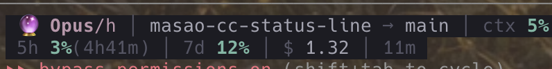

# masao-cc-status-line

Minimal & refined status line for [Claude Code](https://docs.anthropic.com/en/docs/claude-code).

## Themes

### Default — full badge UI (2 lines)

```
[🔮 Opus/h][📁 myproject → main][$] 3.45 [↑120/↓30]
[ctx]   25%(250k)   [5h] 12%(3h42m) [7d] 8%(5d12h) [⏱45m]
```

### `simple-2` — low cognitive load (2 lines)



```
🔮 Opus/h │ myproject → main │ ctx 25%
5h 12%(3h42m) │ 7d 8% │ $ 3.45 │ 1h00m
```

### `simple-1` — low cognitive load (1 line)

```
🔮 Opus/h │ myproject → main │ ctx 25% │ 5h 12%(3h42m) │ 7d 8% │ $ 3.45 │ 1h00m
```

The `simple` themes use a uniform dark background with muted colors (teal/amber/rose) to minimize visual noise while keeping all essential info.

## Features

- **3 themes** — `default` (rich badges), `simple-2` (2-line flat), `simple-1` (1-line flat)
- **TrueColor badge UI** (default) — label + value with 2-tone background colors
- **Context bar** (default) — visual progress indicator with centered percentage & token count
- **Rate limits** — 5-hour / 7-day usage with remaining time until reset
- **Color gradient** — green → yellow → red based on usage
  - ctx: green ≤50%, yellow ≤85%, red >85%
  - 5h/7d: green ≤50%, red >50%
- **Model badge** — per-model emoji & color (🔮 Opus / ✨ Sonnet / 🍃 Haiku) with effort level
- **Git branch** — `dir → branch` display
- **Session cost** — running total in USD
- **Line diff** (default) — `↑added/↓removed` with k-notation for large numbers
- **Session duration** — elapsed time
- **Zero dependencies** — pure Node.js, no external packages

## Install

```bash
npm install -g masao-cc-status-line
```

## Setup

Add to `~/.claude/settings.json`:

```json
{
  "statusLine": {
    "type": "command",
    "command": "npx -y masao-cc-status-line"
  }
}
```

To use a simple theme:

```json
{
  "statusLine": {
    "type": "command",
    "command": "npx -y masao-cc-status-line simple-2"
  }
}
```

> **Note:** If `npx` or `node` doesn't work in your environment, use the absolute path:
> ```json
> "command": "/path/to/node /path/to/masao-cc-status-line/bin/cli.js simple-2"
> ```

## How it works

Claude Code pipes session data as JSON to stdin. The script parses it and outputs ANSI-colored text to stdout.

```
stdin (JSON) → masao-cc-status-line [theme] → stdout (ANSI)
```

### Input fields used

| Field | Description |
|---|---|
| `model.display_name` | Model name (Opus/Sonnet/Haiku) |
| `workspace.current_dir` | Working directory |
| `cost.total_cost_usd` | Session cost |
| `cost.total_lines_added` | Lines added |
| `cost.total_lines_removed` | Lines removed |
| `cost.total_duration_ms` | Session duration |
| `context_window.used_percentage` | Context usage % |
| `context_window.total_input_tokens` | Input token count |
| `rate_limits.five_hour` | 5-hour rate limit (used_percentage, resets_at) |
| `rate_limits.seven_day` | 7-day rate limit (used_percentage, resets_at) |

### Preview locally

```bash
# Default theme
echo '{"model":{"display_name":"Claude Opus 4.6"},"workspace":{"current_dir":"/tmp/myproject"},"cost":{"total_cost_usd":3.45,"total_duration_ms":3600000,"total_lines_added":120,"total_lines_removed":30},"context_window":{"used_percentage":25,"total_input_tokens":250000},"rate_limits":{"five_hour":{"used_percentage":12,"resets_at":'$(($(date +%s)+13420))'},"seven_day":{"used_percentage":8,"resets_at":'$(($(date +%s)+475200))'}}}' | npx masao-cc-status-line

# Simple theme (2-line)
echo '...' | npx masao-cc-status-line simple-2

# Simple theme (1-line)
echo '...' | npx masao-cc-status-line simple-1
```

## License

MIT
